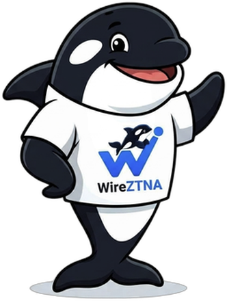

# Zeta the orca — the WireZTNA mascot

Meet **Zeta**, the orca that represents WireZTNA.

## Why an orca?

An orca is a fitting symbol for a Zero Trust Network Access project:

- **Smart and coordinated.** Orcas hunt in tightly organised pods where every
  member has a role — a natural fit for the WireZTNA access model of
  *User → Group → Publisher → exposed resources*.
- **In control of its waters.** As an apex predator, nothing moves through its
  territory unnoticed. That is exactly what a ZTNA perimeter does: every
  connection is explicit, authorised, and accounted for.
- **Friendly, not threatening.** Zeta is on *your* side. WireZTNA guards your
  private resources so you can grant precise, per-user access with confidence.

## Why "Zeta"?

The name comes from **ZTNA** (Zero Trust Network Access). "Zeta" keeps the
nod to the acronym while being short, easy to pronounce in any language, and
memorable as a character name.

## Release codenames

WireZTNA releases are named after marine creatures, in the spirit of projects
like Debian (Toy Story characters) and Ubuntu (animals). The first release
sets the tone:

| Version | Codename |
| ------- | -------- |
| v1.0.5  | Orca     |

Future releases will continue the marine theme.

## Using the mascot

Zeta's artwork lives at [`.github/assets/wireztna-mascot.png`](../.github/assets/wireztna-mascot.png)
(transparent PNG). The project logo lives at
[`.github/assets/wireztna-logo.png`](../.github/assets/wireztna-logo.png).

Please keep Zeta friendly: use the mascot to welcome contributors and users,
not in ways that misrepresent the project or its security posture.
